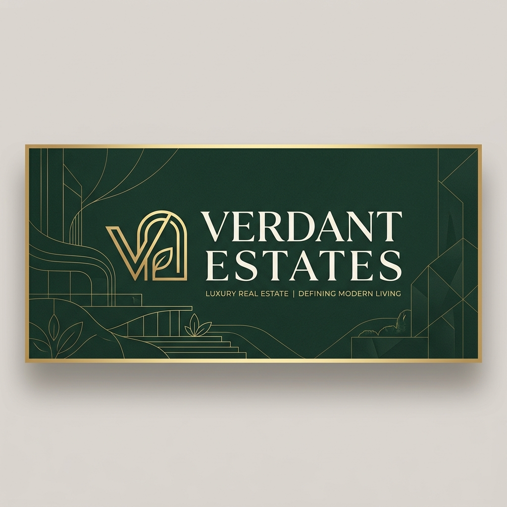

<div align="center">
  
  

  # 🌿 Verdant Estates

  ### *Boutique Real Estate Studio & Management System*

  [](https://nextjs.org/)
  [](https://react.dev/)
  [](https://www.typescriptlang.org/)
  [](https://tailwindcss.com/)
  <br/>
  [](https://www.mongodb.com/)
  [](https://gsap.com/)
  [](https://github.com/hmans/ogl)
  [](https://jwt.io/)

  <p align="center">
    A premium, highly interactive web application combining editorial-grade typography, dynamic WebGL fluid physics, and smooth GSAP choreography to elevate the real estate browsing experience.
  </p>

  <h4>
    <a href="#-key-features">Key Features</a> •
    <a href="#-design-system--aesthetics">Design System</a> •
    <a href="#-getting-started">Getting Started</a> •
    <a href="#-information-architecture">Project Structure</a> •
    <a href="#-api-endpoints">API Endpoints</a>
  </h4>

</div>

---

## ✨ Key Features

### 🎨 Visual & Motion Experience
- **Interactive WebGL Hero:** Built with **OGL** featuring an organic fractional Brownian motion (fbm) noise wave field that warps and flows dynamically in response to mouse movement.
- **GSAP Choreographed Entrances:** High-end motion sequences for headings, grid components, and word-by-word text reveals on page load.
- **Micro-Animations:** Interactive cards, hover states, and dynamic page loaders featuring spinning foliage with live percentage metrics.
- **Custom Sidebar Navigation:** Minimalist full-height navigation panel operating via a hamburger toggle.

### 💼 Business & Administration
- **Filterable Listings:** Instant client-side property filtering matching modern property-hunting workflows.
- **Secure Lead Funnel:** Client messages are validated on submit, saved to MongoDB, and streamed instantly to the administrator's interface.
- **JWT-Protected Admin Panel (`/admin`):** Secure dashboard implementing HTTP-Only cookies, bcrypt credentials hashing, and full session persistence.
- **Interactive Messages Table:** Admin dashboard for reviewing and deleting user inquiries with built-in modal confirmation.

---

## 🎨 Design System & Aesthetics

Verdant Estates is built with an **editorial, high-fashion layout** inspired by luxury architecture studios.

| Token | Details | CSS Variable / Tailwind |
| :--- | :--- | :--- |
| **Color Palette** | Ivory White, Sand Gold, & Deep Forest Green | `forest-50` (Ivory) $\rightarrow$ `forest-950` (Verdant) |
| **Typography** | Serif headings + clean sans-serif body | `Cormorant Garamond` & `Inter` |
| **Aesthetic Theme** | Glassmorphism, high contrast, clean grid borders | `backdrop-blur-md` & minimal hairlines |
| **Atmosphere** | Ambient, responsive, luxury boutique feel | WebGL organic background + GSAP transitions |

---

## 📂 Information Architecture

```mermaid
graph TD
    A[Root App Router] --> B[/]
    A --> C[/properties]
    A --> D[/about]
    A --> E[/agents]
    A --> F[/contact]
    A --> G[/admin]
    G --> G1[/login]
    G --> G2[/dashboard]
    G --> G3[/messages]
    A --> H[/api]
    H --> H1[/api/contact]
    H --> H2[/api/admin/login]
    H --> H3[/api/admin/messages]
```

```text
├── app/
│   ├── page.tsx              # Home Page (WebGL Hero + featured properties)
│   ├── about/                # Agency biography & philosophy
│   ├── properties/           # Interactive property catalogue with filtering
│   ├── agents/               # Meet the team Grid
│   ├── contact/              # Interactive contact inquiry form
│   ├── admin/                # Secure dashboard route group
│   │   ├── login/            # Admin sign-in screen
│   │   ├── dashboard/        # Operations Overview
│   │   └── messages/         # Server-rendered user message repository
│   └── api/                  # REST Endpoint routes
│       ├── contact/          # Client message endpoint
│       └── admin/            # Admin auth & message management
├── components/
│   ├── Sidebar.tsx           # Drawer navigation panel
│   ├── PageLoader.tsx        # Branded loading sequence
│   ├── HeroCanvas.tsx        # WebGL backdrop renderer
│   ├── HomeClient.tsx        # GSAP client orchestration
│   └── MessagesTable.tsx     # Admin table with active state modals
├── lib/
│   ├── db.ts                 # Mongoose cached connection utility
│   ├── auth.ts               # JSON Web Token verification & signing
│   └── data.ts               # Static properties & team records
└── models/
    └── Contact.ts            # Mongoose Contact Message Schema
```

---

## ⚡ API Endpoints

### 📬 Public Endpoints

#### `POST /api/contact`
Submits a client inquiry to the database.
- **Request Body:**
  ```json
  {
    "name": "Jane Doe",
    "email": "jane@example.com",
    "message": "Interested in the Timberline Cabin."
  }
  ```
- **Response:** `201 Created` on success.

---

### 🔒 Admin Endpoints *(JWT Protected)*

#### `POST /api/admin/login`
Authenticates credentials and issues an HTTP-Only cookie.
- **Request Body:**
  ```json
  {
    "email": "admin@verdant.com",
    "password": "admin"
  }
  ```

#### `DELETE /api/admin/login`
Clears the session cookie (Log out).

#### `GET /api/admin/messages`
Retrieves all messages from the database.

#### `DELETE /api/admin/messages/[id]`
Removes an inquiry from the database.

---

## 🚀 Getting Started

### 📋 Prerequisites
- **Node.js** (v18+)
- **MongoDB** Instance (Local or Atlas)

### 🛠️ Local Setup

1. **Clone & Install Dependencies:**
   ```bash
   git clone https://github.com/lithiraMalkith/Verdant.git
   cd estate-app
   npm install
   ```

2. **Configure Environment Variables:**
   Create a `.env` file at the root of the project using the template below:
   ```env
   MONGODB_URI=mongodb+srv://... or mongodb://localhost:27017/verdant
   JWT_SECRET=your_super_secret_jwt_key_here
   ADMIN_EMAIL=admin@verdant.com
   ADMIN_PASSWORD=admin123
   ```

3. **Start Development Environment:**
   ```bash
   npm run dev
   ```
   *The application will launch on **http://localhost:3000**.*

4. **Verify Admin Dashboard Access:**
   Visit `http://localhost:3000/admin/login` and authenticate using your `ADMIN_EMAIL` and `ADMIN_PASSWORD` defined in `.env`.

---

<div align="center">
  <sub>Designed & Developed by Lithira Malkith. All rights reserved. 🌿</sub>
</div>
